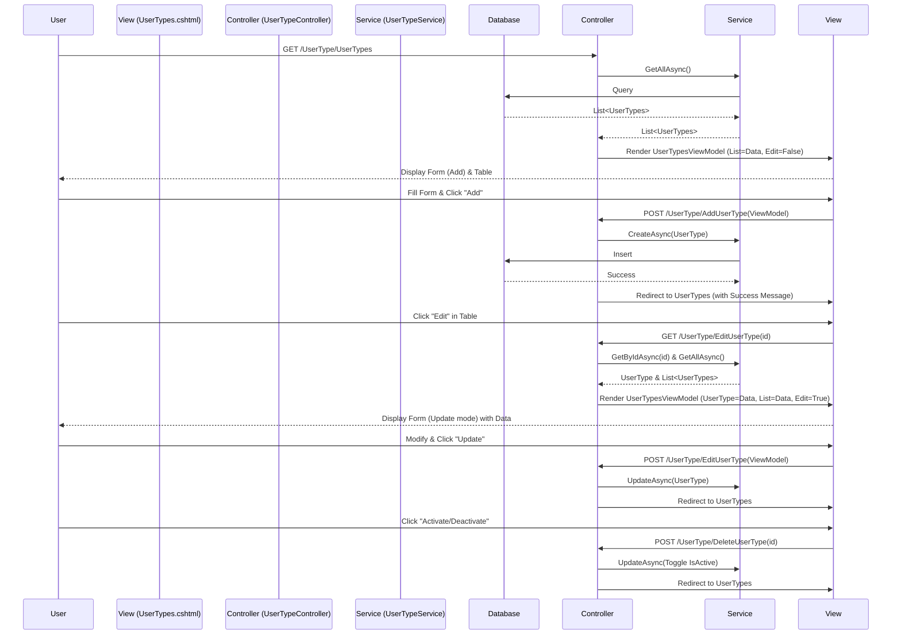

# User Type Flow Documentation

This document outlines the components, dependencies, inputs, outputs, and interactions within the **User Type Management** flow in the PharmaCare application.

## 1. Overview
The User Type flow allows for the creation, modification, display, and activation/deactivation of User Types (e.g., Administrator, Manager). It utilizes a **single-page architecture** where the listing, addition, and editing of records occur within the same view.

## 2. Components

### 2.1 View Controller (`UserTypeController`)
*   **Path**: `PharmaCare.Web/Controllers/Membership/UserTypeController.cs`
*   **Purpose**: Orchestrates the flow, handles HTTP requests, interacts with the service layer, and prepares data for the view.
*   **Dependencies**:
    *   `IUserTypeService`: Interface for data access operations (Create, Read, Update).

#### Actions & Interactions
| Action | Method | Purpose | Inputs | Outputs |
| :--- | :--- | :--- | :--- | :--- |
| **UserTypes** | `GET` | **Initial Load**: Loads the combined view with a list of user types and an empty form. | None | `View(UserTypesViewModel)` (IsEditMode=false) |
| **AddUserType** | `POST` | **Create**: Handles form submission to create a new user type. | `UserTypesViewModel` | `RedirectToAction("UserTypes")` (On Success/Fail) with `TempData` message |
| **EditUserType** | `GET` | **Load Edit**: Loads the combined view but populates the form with a specific user type's data. | `id` (Encrypted String) | `View("UserTypes", UserTypesViewModel)` (IsEditMode=true) |
| **EditUserType** | `POST` | **Update**: Handles form submission to update an existing user type. | `UserTypesViewModel` | `RedirectToAction("UserTypes")` (On Success/Fail) with `TempData` message |
| **DeleteUserType** | `POST` | **Toggle Status**: Soft-deletes or reactivates a user type. | `id` (Encrypted String) | `RedirectToAction("UserTypes")` with `TempData` message |

---

### 2.2 Model (`UserTypes`)
*   **Path**: `PharmaCare.Domain/Models/Membership/UserTypes.cs` (Inherits from `BaseModelWithStatus`)
*   **Purpose**: Represents the database entity for a User Type.
*   **Key Properties**:
    *   `UserTypeID` (PK, int): Unique identifier.
    *   `UserType` (string): The name of the user type.
    *   `IsActive` (bool): Status flag (Active/Inactive), inherited.
    *   `CreatedBy`, `CreatedDate`, `UpdatedBy`, `UpdatedDate`: Audit fields, inherited.

---

### 2.3 View Model (`UserTypesViewModel`)
*   **Path**: `PharmaCare.Domain/ViewModels/UserTypesViewModel.cs`
*   **Purpose**: Data Transfer Object (DTO) specifically designed to power the combined single-page view. It aggregates the single entity being edited and the list of entities for display.
*   **Properties**:
    *   `CurrentUserType` (`UserTypes`): Holds the data for the form (Add/Edit).
    *   `UserTypesList` (`List<UserTypes>`): Holds the list of all user types for the data table.
    *   `IsEditMode` (`bool`): Flag to toggle UI elements (Button text, Form Action, Cancel button).

---

### 2.4 View (`UserTypes.cshtml`)
*   **Path**: `PharmaCare.Web/Views/UserType/UserTypes.cshtml`
*   **Purpose**: The User Interface.
*   **Interactions**:
    *   **Form Section**: Binds to `Model.CurrentUserType`. Submits to `AddUserType` or `EditUserType` based on `Model.IsEditMode`.
    *   **Table Section**: Iterates over `Model.UserTypesList`. Displays status badges.
    *   **Buttons**:
        *   *Edit*: Links to `EditUserTypeInline` (GET) with encrypted ID.
        *   *Toggle/Delete*: Submits form to `DeleteUserType` (POST) to toggle status.

## 3. Interaction Flow Diagram

